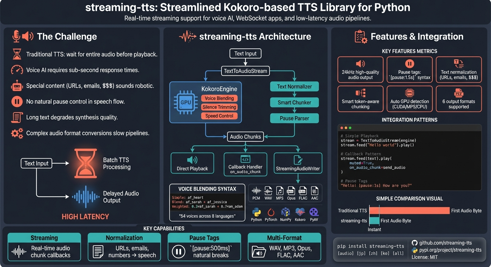

---

# streaming-tts

Lightweight streaming text-to-speech with Kokoro engine.

## Features

- **Streaming TTS**: Real-time audio synthesis with callback support
- **Voice Blending**: Mix multiple voices with weighted formulas
- **Pause Tags**: Insert natural pauses with `[pause:1.5s]` syntax
- **Text Normalization**: Convert URLs, emails, numbers, money to spoken form
- **Smart Chunking**: Token-aware text splitting for optimal quality
- **Multi-Format Output**: Export to WAV, MP3, Opus, FLAC, AAC (with `[audio]` extra)
- **54 Voices**: American, British English + 7 other languages

## Installation

```bash
pip install streaming-tts
```

For development installation:
```bash
pip install -e .
```

### Optional Extras

```bash
# Japanese language support
pip install streaming-tts[jp]

# Chinese language support
pip install streaming-tts[zh]

# Korean language support
pip install streaming-tts[ko]

# All features
pip install streaming-tts[all]
```

**Note:** Non-English languages require `espeak-ng` to be installed on your system.

## Quick Start

```python
from streaming_tts import TextToAudioStream, KokoroEngine

# Initialize the engine
engine = KokoroEngine(voice="af_heart")

# Create stream and play
stream = TextToAudioStream(engine)
stream.feed("Hello, world! This is a test of streaming text to speech.").play()
```

## Pause Tags

Insert natural pauses in your text:

```python
text = "Hello! [pause:1s] How are you? [pause:500ms] I hope you're well."
stream.feed(text).play()
```

## Text Normalization

Automatically convert special content to spoken form:

```python
from streaming_tts import normalize_text, NormalizationOptions

options = NormalizationOptions(normalize=True)

# URLs, emails, numbers, money, etc.
text = "Visit https://example.com or email user@test.com. Price: $42.50"
normalized = normalize_text(text, options)
# -> "Visit https example dot com or email user at test dot com. Price: forty-two dollars and fifty cents"
```

## Smart Chunking

Split long text into optimal chunks for TTS:

```python
from streaming_tts import smart_split, process_text_with_pauses
import time

# Process text with pauses
for item in process_text_with_pauses(text, normalize=True):
    if isinstance(item, float):
        time.sleep(item)  # Pause
    else:
        stream.feed(item).play()  # Speak
```

## Multi-Format Audio Export

```python
from streaming_tts import StreamingAudioWriter

# Requires: pip install streaming-tts[audio]
writer = StreamingAudioWriter("mp3", sample_rate=24000)

for audio_chunk in audio_chunks:
    mp3_data = writer.write_chunk(audio_chunk)
    # Stream or save mp3_data

final_data = writer.write_chunk(finalize=True)
writer.close()
```

## Usage with Callbacks

```python
from streaming_tts import TextToAudioStream, KokoroEngine

def on_audio_chunk(chunk):
    # Process audio chunk (e.g., send over websocket)
    pass

def on_stream_stop():
    print("Audio stream finished")

engine = KokoroEngine(voice="af_heart")
stream = TextToAudioStream(engine, on_audio_stream_stop=on_stream_stop)
stream.feed("Hello world").play(muted=True, on_audio_chunk=on_audio_chunk)
```

## Available Voices

### American English (lang_code='a')
- Female: `af_heart`, `af_alloy`, `af_aoede`, `af_bella`, `af_jessica`, `af_kore`, `af_nicole`, `af_nova`, `af_river`, `af_sarah`, `af_sky`
- Male: `am_adam`, `am_echo`, `am_eric`, `am_fenrir`, `am_liam`, `am_michael`, `am_onyx`, `am_puck`, `am_santa`

### British English (lang_code='b')
- Female: `bf_alice`, `bf_emma`, `bf_isabella`, `bf_lily`
- Male: `bm_daniel`, `bm_fable`, `bm_george`, `bm_lewis`

### Other Languages
- Japanese: `jf_alpha`, `jf_gongitsune`, `jf_nezumi`, `jf_tebukuro`, `jm_kumo`
- Chinese: `zf_xiaobei`, `zf_xiaoni`, `zf_xiaoxiao`, `zf_xiaoyi`, `zm_yunjian`, `zm_yunxi`, `zm_yunxia`, `zm_yunyang`
- Spanish: `ef_dora`, `em_alex`, `em_santa`
- French: `ff_siwis`
- Hindi: `hf_alpha`, `hf_beta`, `hm_omega`, `hm_psi`
- Italian: `if_sara`, `im_nicola`
- Portuguese: `pf_dora`, `pm_alex`, `pm_santa`

## Voice Blending

You can blend multiple voices using weighted formulas:

```python
engine = KokoroEngine(voice="0.3*af_sarah + 0.7*am_adam")
```

## API Reference

### KokoroEngine

```python
KokoroEngine(
    voice="af_heart",        # Voice name or blend formula
    default_speed=1.0,       # Speech speed multiplier
    trim_silence=True,       # Remove silence from audio
    debug=False              # Enable debug output
)
```

### TextToAudioStream

```python
TextToAudioStream(
    engine,                      # KokoroEngine instance
    on_audio_stream_start=None,  # Callback when audio starts
    on_audio_stream_stop=None,   # Callback when audio stops
    on_audio_chunk=None,         # Callback for each audio chunk
    on_word=None,                # Callback for word timing
    muted=False                  # Disable speaker output
)
```

## Requirements

- Python 3.9-3.12
- PyAudio (may require system dependencies)
- Torch

### Windows Note
PyAudio on Windows may require Visual C++ Build Tools. If you encounter issues:
```bash
pip install pipwin
pipwin install pyaudio
```

## License

MIT
